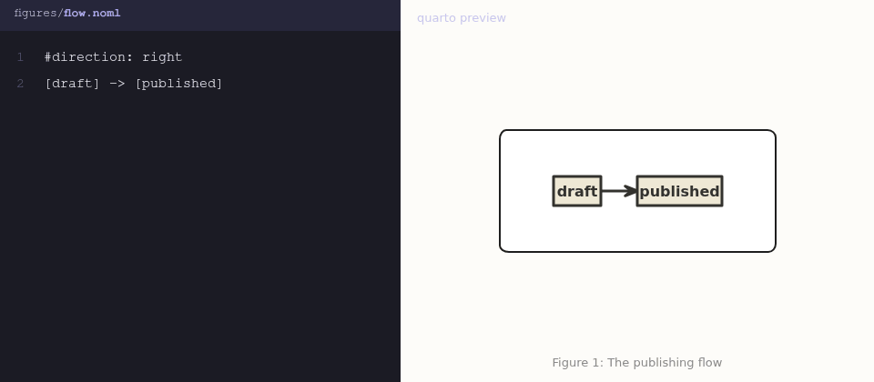

# quarto-livefigures

[](https://github.com/seandavi/quarto-livefigures/actions/workflows/ci.yml)
[](https://github.com/seandavi/quarto-livefigures/releases)
[](LICENSE)
[](https://livefigures.seandavis.net)

Editable, version-controlled figures as first-class Quarto citizens.
Reference the figure's *source file* with normal figure syntax and
`quarto render` does the rest — no manual SVG/PNG exports, no generated
files in version control.

```markdown
{#fig-arch width=80%}

{#fig-totals}
```

Supported source formats:

| Format | Extension | Best for |
| ------ | --------- | -------- |
| [Excalidraw](https://excalidraw.com/) | `.excalidraw` | hand-drawn diagrams and sketches |
| [Vega-Lite](https://vega.github.io/vega-lite/) | `.vl.json` | data-driven charts (and LLM/agent-authored figures) |
| [Vega](https://vega.github.io/vega/) | `.vg.json` | low-level chart specs, force-directed graphs |
| [nomnoml](https://nomnoml.com/) | `.noml`, `.nomnoml` | node-edge/UML diagrams from terse text |
| [WaveDrom](https://wavedrom.com/) | `.wavedrom`, `.wavedrom.json` | digital timing & register diagrams |
| [bytefield](https://bytefield-svg.deepsymmetry.org/) | `.bytefield` | byte/packet layout diagrams |
| [Graphviz](https://graphviz.org/) | `.dot`, `.gv` | classic graph layouts (file-referenced; complements Quarto's code-cell dot) |
| [DBML](https://dbml.dbdiagram.io/) | `.dbml` | database schema diagrams |
| [PlantUML](https://plantuml.com/) † | `.puml`, `.plantuml` | UML: sequence, class, activity … |
| [D2](https://d2lang.com/) † | `.d2` | modern declarative diagrams |
| [C4-PlantUML](https://github.com/plantuml-stdlib/C4-PlantUML) † | `.c4` | C4 architecture diagrams |
| [Structurizr](https://structurizr.com/) † | `.structurizr` | C4 via the Structurizr DSL |
| [erd](https://github.com/BurntSushi/erd) † | `.erd` | entity-relationship diagrams |
| [ditaa](https://ditaa.sourceforge.net/) † | `.ditaa` | ASCII art → polished diagrams |
| [pikchr](https://pikchr.org/) † | `.pikchr` | PIC-style technical diagrams |
| [svgbob](https://github.com/ivanceras/svgbob) † | `.svgbob` | ASCII art → SVG |
| [TikZ](https://tikz.dev/) † | `.tikz` | LaTeX diagrams (complete `standalone` docs) |

† Rendered via a [kroki](https://kroki.io/) endpoint — the one backend
class that needs the network (on cache misses only). The diagram source is
sent to the endpoint; for private diagrams, self-host kroki and set
`livefigures: kroki-url: <url>` in your metadata. All other formats render
fully offline.



The source file is the single source of truth. Captions, labels,
cross-references, sizing, layout, subfigures, and lightbox all work exactly
as for any other Quarto figure.

## Installation

```bash
quarto add seandavi/quarto-livefigures
```

Requires **Node.js >= 18** on your PATH (the only external dependency).
Rendering is fully offline — fonts and the rasterizer ship with the
extension.

Enable the filter in `_quarto.yml` (or document front matter):

```yaml
filters:
  - at: pre-ast
    path: livefigures
```

(The `at: pre-ast` placement makes cross-references work on inline
code-block figures; a plain `filters: [livefigures]` also works if you
only use file-referenced figures.)

## Usage

Any Quarto image whose target is a supported source file is rendered at
build time into a content-addressed cache (`_livefigures/`, add it to
`.gitignore`) and flows through Quarto's native figure pipeline:

```markdown
{#fig-flow width=60%}

See @fig-flow for details.
```

Small diagrams can live **inline** as fenced code blocks instead of files —
same pipeline, cache, and figure semantics:

````markdown
```{.nomnoml #fig-pipe fig-cap="The pipeline"}
[Filter] -> [Cache] -> [SVG]
```
````

Block classes: `.excalidraw`, `.vega-lite`, `.vega`, `.nomnoml`,
`.wavedrom`, `.bytefield`, `.dot`, `.dbml`, `.plantuml`, `.d2`, `.c4`,
`.structurizr`, `.erd`, `.ditaa`, `.pikchr`, `.svgbob`, `.tikz`.

- **HTML formats** (articles, websites, books, dashboards, RevealJS): SVG
  with the hand-drawn fonts embedded — correct offline and in
  `embed-resources: true` documents.
- **PDF/LaTeX**: high-resolution PNG rasterized by the bundled renderer,
  so fonts are always correct (LaTeX's SVG conversion is not required or
  used).

Re-renders happen only when the scene, options, or extension version
change; otherwise the cache is reused.

### Options

Per figure (attributes) or project-wide (metadata):

| Option       | Values                              | Default                     |
| ------------ | ----------------------------------- | --------------------------- |
| `theme`      | `light`, `dark`, `auto`             | `auto` (HTML), else `light` |
| `background` | `transparent`, `scene`              | `transparent`               |

```markdown
{theme=dark background=scene}
```

```yaml
livefigures:
  theme: light
  background: scene
```

`theme: auto` renders once (light); Excalidraw figures restyle on dark
pages with the same CSS filter Excalidraw itself uses for dark mode.
Charts (Vega/Vega-Lite) deliberately stay light under `auto` — inverting
data-encoded colors would misrepresent them; use an explicit `theme=dark`
for the vega dark theme. For Excalidraw, `theme=dark` performs a true dark
export.

## For AI agents

`skills/livefigures/SKILL.md` is a single-file briefing that teaches a
coding agent this extension: syntax (file vs fenced block), a
format-selection table with per-format doc links, options, and failure
modes. Drop it into your project (e.g. `.claude/skills/livefigures/`) or
paste it into any system prompt. See
[livefigures.seandavis.net/agents](https://livefigures.seandavis.net/agents)
for the workflows it enables.

## Examples

See [`examples/`](examples/) for a minimal [article](examples/article),
[book](examples/book), and [RevealJS deck](examples/revealjs).

## Limitations

- **Windows is untested** (macOS and Linux are exercised; Windows CI is a
  planned fast-follow).
- **DOCX and EPUB** are untested ("may work"); verified formats are the
  HTML family and PDF.
- **CJK text** (Excalidraw's Xiaolai font, 13 MB) is not bundled; scenes
  using it fail with a clear error. Open an issue if you need it.
- Errors are deliberate and loud: a missing Node runtime or a corrupt
  source file aborts the render rather than publishing a broken figure.

## How it works

A Lua filter rewrites `.excalidraw` image targets to cached assets produced
by a bundled, headless Node renderer (Excalidraw's own export code + a WASM
rasterizer). Design decisions are recorded in
[`docs/ARCHITECTURE.md`](docs/ARCHITECTURE.md) and
[`docs/adr/`](docs/adr/).

The name is deliberate: Excalidraw is the first backend, not the last —
the roadmap includes other editable-figure formats (see issue #7).

## Contributing, license, citation

Contributions welcome — see [CONTRIBUTING.md](CONTRIBUTING.md) and the
[Contributor Covenant](CODE_OF_CONDUCT.md). MIT [licensed](LICENSE). If
you use livefigures in academic work, [CITATION.cff](CITATION.cff) has a
citable reference (GitHub's "Cite this repository" button uses it).

## Development

```bash
cd renderer && npm install && npm run build   # rebuild the committed bundle
node --test tests/test.mjs                    # end-to-end tests (needs quarto)
```
