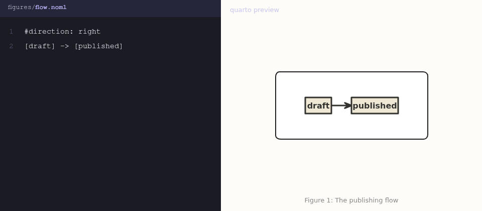

# quarto-livefigures

[](https://github.com/seandavi/quarto-livefigures/actions/workflows/ci.yml)
[](https://github.com/seandavi/quarto-livefigures/releases)
[](LICENSE)
[](https://livefigures.seandavis.net)
[](https://quarto.org/docs/extensions/)
[](https://www.npmjs.com/package/livefigures)

Editable, version-controlled figures as first-class Quarto citizens.
Reference the figure's *source file* with normal figure syntax and
`quarto render` does the rest — no manual SVG/PNG exports, no generated
files in version control.

```markdown
{#fig-arch width=80%}

{#fig-totals}
```



## The loop: edit → render → **look at it** → fix

That middle step is the point. Diagram bugs are usually *layout* bugs,
and layout bugs render successfully, exit 0, and produce a perfectly
valid figure that is wrong — a chain laid out as a diagonal staircase, a
legend label silently truncated, a directive showing up as literal text.
Nothing downstream catches those. Looking does.

So the extension ships the tools to look, and they run without a full
`quarto render`:

```bash
node _extensions/seandavi/livefigures/cli.mjs validate figures/arch.dot
node _extensions/seandavi/livefigures/cli.mjs render   figures/arch.dot -o /tmp/arch.png
```

`validate` catches broken sources; `render -o` gets you the figure to
actually look at. Agents get the same loop through the [MCP
server](#mcp-server--agents-can-see-their-figures), which returns the
rendered image in-context. The [CLI
docs](https://livefigures.seandavis.net/cli.html) list the specific
layout failures worth checking for and how to fix each.

## What you can write

Supported source formats. **Excalidraw sources come from the Excalidraw
editor** — draw it, save it, commit it. The text and JSON grammars below
it are the ones to hand-write or generate:

| Format | Extension | Renders | Best for |
| ------ | --------- | ------- | -------- |
| [Excalidraw](https://excalidraw.com/) | `.excalidraw` | **offline** | hand-drawn diagrams and sketches |
| [Vega-Lite](https://vega.github.io/vega-lite/) | `.vl.json` | **offline** | data-driven charts (and LLM/agent-authored figures) |
| [Vega](https://vega.github.io/vega/) | `.vg.json` | **offline** | low-level chart specs, force-directed graphs |
| [nomnoml](https://nomnoml.com/) | `.noml`, `.nomnoml` | **offline** | node-edge/UML diagrams from terse text |
| [WaveDrom](https://wavedrom.com/) | `.wavedrom`, `.wavedrom.json` | **offline** | digital timing & register diagrams |
| [bytefield](https://bytefield-svg.deepsymmetry.org/) | `.bytefield` | **offline** | byte/packet layout diagrams |
| [Graphviz](https://graphviz.org/) | `.dot`, `.gv` | **offline** | classic graph layouts (file-referenced; complements Quarto's code-cell dot) |
| [DBML](https://dbml.dbdiagram.io/) | `.dbml` | **offline** | database schema diagrams |
| [PlantUML](https://plantuml.com/) | `.puml`, `.plantuml` | kroki † | UML: sequence, class, activity … |
| [D2](https://d2lang.com/) | `.d2` | kroki † | modern declarative diagrams |
| [C4-PlantUML](https://github.com/plantuml-stdlib/C4-PlantUML) | `.c4` | kroki † | C4 architecture diagrams |
| [Structurizr](https://structurizr.com/) | `.structurizr` | kroki † | C4 via the Structurizr DSL |
| [erd](https://github.com/BurntSushi/erd) | `.erd` | kroki † | entity-relationship diagrams |
| [ditaa](https://ditaa.sourceforge.net/) | `.ditaa` | kroki † | ASCII art → polished diagrams |
| [pikchr](https://pikchr.org/) | `.pikchr` | kroki † | PIC-style technical diagrams |
| [svgbob](https://github.com/ivanceras/svgbob) | `.svgbob` | kroki † | ASCII art → SVG |
| [TikZ](https://tikz.dev/) | `.tikz` | kroki † | LaTeX diagrams (complete `standalone` docs) |

† *kroki* formats render via a [kroki](https://kroki.io/) endpoint — the
one backend class that needs the network (on cache misses only). The
diagram source is sent to the endpoint; for private diagrams, self-host
kroki and set `livefigures: kroki-url: <url>` in your metadata. Everything
marked **offline** renders from renderers bundled with the extension, so a
cache miss with no network still succeeds.

`cli.mjs formats` prints the same distinction (as `local` / `kroki`) if
you'd rather check from the terminal than from the docs.

### Do you need livefigures?

Use a **mermaid or Graphviz code cell** — built into Quarto, nothing to
install — if you need a flowchart, sequence diagram, or simple graph and
you're happy with the source living inline in the document.

Reach for **livefigures** when you need:

- a format Quarto has no cell for — Vega-Lite charts, WaveDrom timing
  diagrams, bytefield layouts, Excalidraw sketches
- **layout control** code cells can't express — Graphviz clusters,
  `rank`, edge routing
- the figure source in **its own file**, editable and diffable on its own
- **deterministic PDF** output with bundled fonts
- **warm-cache rebuilds** that re-render nothing

A longer comparison with `pandoc-ext/diagram` and the kroki filters is
[below](#how-is-this-different-from-mermaid-cells--diagram--quarto-kroki).

The source file is the single source of truth. Captions, labels,
cross-references, sizing, layout, subfigures, and lightbox all work exactly
as for any other Quarto figure.

## Installation

```bash
quarto add seandavi/quarto-livefigures
```

> Installs as **`livefigures`** — that is the name in `_extensions/`, in
> your `filters:` config, on npm, and in the Quarto extension listings.
> The repo carries the conventional `quarto-` prefix; everything else
> drops it.

livefigures is listed in the official [Quarto extension
listing](https://quarto.org/docs/extensions/).

Requires **Node.js >= 18** on your PATH (the only external dependency).
Rendering is fully offline — fonts and the rasterizer ship with the
extension.

Enable the filter in `_quarto.yml` (or document front matter):

```yaml
filters:
  - at: pre-ast
    path: livefigures
```

(The `at: pre-ast` placement makes cross-references work on inline
code-block figures; a plain `filters: [livefigures]` also works if you
only use file-referenced figures.)

## Usage

Any Quarto image whose target is a supported source file is rendered at
build time into a content-addressed cache (`_livefigures/`, add it to
`.gitignore`) and flows through Quarto's native figure pipeline:

```markdown
{#fig-flow width=60%}

See @fig-flow for details.
```

Small diagrams can live **inline** as fenced code blocks instead of files —
same pipeline, cache, and figure semantics:

````markdown
```{.nomnoml #fig-pipe fig-cap="The pipeline"}
[Filter] -> [Cache] -> [SVG]
```
````

Block classes: `.excalidraw`, `.vega-lite`, `.vega`, `.nomnoml`,
`.wavedrom`, `.bytefield`, `.dot`, `.dbml`, `.plantuml`, `.d2`, `.c4`,
`.structurizr`, `.erd`, `.ditaa`, `.pikchr`, `.svgbob`, `.tikz`.

- **HTML formats** (articles, websites, books, dashboards, RevealJS): SVG
  with the hand-drawn fonts embedded — correct offline and in
  `embed-resources: true` documents.
- **PDF/LaTeX**: high-resolution PNG rasterized by the bundled renderer,
  so fonts are always correct (LaTeX's SVG conversion is not required or
  used).
- **DOCX**: high-resolution PNG (same rasterization path as PDF/LaTeX).

Re-renders happen only when the scene, options, or extension version
change; otherwise the cache is reused.

### Options

Per figure (attributes) or project-wide (metadata):

| Option | Values | Supported by | Default |
| ------ | ------ | ------------ | ------- |
| `theme` | `light`, `dark`, `auto` | `light`/`auto`: all backends. **`dark`: Excalidraw, Vega-Lite and Vega only** — every other backend errors | `auto` (HTML), else `light` |
| `background` | `transparent`, `scene` | **`scene`: Excalidraw, Vega-Lite and Vega only** — every other backend errors | `transparent` |

```markdown
{theme=dark background=scene}
```

```yaml
livefigures:
  theme: light
  background: scene
```

⚠️ **A project-wide `theme: dark` aborts the render of any document
containing a Graphviz, nomnoml, PlantUML, D2 (etc.) figure** — the
unsupported-option error is deliberate, so it fails the build rather
than publishing an unreadable figure. For a dark deck or site, leave the
project default alone and opt in per figure:

```markdown
{theme=dark}
```

`theme: auto` renders once (light); Excalidraw figures restyle on dark
pages with the same CSS filter Excalidraw itself uses for dark mode.
Charts (Vega/Vega-Lite) deliberately stay light under `auto` — inverting
data-encoded colors would misrepresent them; use an explicit `theme=dark`
for the vega dark theme. For Excalidraw, `theme=dark` performs a true dark
export.

## How is this different from mermaid cells / diagram / quarto-kroki?

(The short version is the [decision rule](#do-you-need-livefigures)
above; this is the detail behind it.)

Quarto natively renders Mermaid and Graphviz in *executable code
cells*, and three good community extensions overlap with livefigures:
[pandoc-ext/diagram](https://github.com/pandoc-ext/diagram)
(Graphviz/Mermaid/PlantUML/TikZ/Asymptote/D2 via locally *installed*
tools) plus [resepemb/quarto-kroki](https://github.com/resepemb/quarto-kroki)
and [fermarsan/quarto-kroki](https://github.com/fermarsan/quarto-kroki)
(any kroki format via a kroki server). All of these are code-block-only.
What livefigures adds:

- **File-referenced figures** — `` with
  native image syntax, so sources made in real editors (Excalidraw
  today) are figures too, not just typed DSLs. Fenced blocks also work.
- **Nothing to install, no network for local formats** — nine formats
  render from renderers *bundled with the extension* (wasm/JS; Node ≥ 18
  is the only requirement). `diagram` needs each tool on your PATH; the
  kroki filters need a server round-trip for every diagram.
- **Deterministic PDF** — bundled rasterizer with bundled fonts, same
  output on every machine.
- **Content-addressed caching** — warm rebuilds re-render nothing (and
  re-contact no server).
- **Agent tooling** — the [skill](skills/livefigures/SKILL.md),
  [MCP server](https://livefigures.seandavis.net/mcp.html), and
  [CLI](https://livefigures.seandavis.net/cli.html) are part of the
  project, not an afterthought.

If a Mermaid code cell or a kroki filter covers your needs, use them —
livefigures uses kroki itself for the formats that need it, adding the
caching, file-referenced sources, and PDF pipeline on top.

## For AI agents

> **Who writes what.** Humans draw in Excalidraw and commit the scene —
> its JSON is hand-placed coordinates, which is exactly what an editor is
> for and exactly what a generator should not produce. Agents and scripts
> write the text and JSON grammars: Graphviz, D2, nomnoml, Vega-Lite,
> PlantUML, DBML, and the rest. Both flow through the same pipeline,
> cache, and figure semantics.

`skills/livefigures/SKILL.md` is a single-file briefing that teaches a
coding agent this extension: syntax (file vs fenced block), a
format-selection table with per-format doc links, options, and failure
modes. Drop it into your project (e.g. `.claude/skills/livefigures/`) or
paste it into any system prompt. See
[livefigures.seandavis.net/agents](https://livefigures.seandavis.net/agents)
for the workflows it enables.

### MCP server — agents can *see* their figures

An MCP server exposes the same renderers as tools (`render`, `validate`,
`list_formats`): an agent writes figure source, calls `render`, and gets
the figure back as an image — so it can visually check and fix its own
work before the figure lands in a document. Rendering matches
`quarto render` (same engines, fonts, options).

Public server (nothing to install):

```bash
claude mcp add --transport http livefigures https://mcp.livefigures.seandavis.net/mcp
```

Local (ships with the extension, offline for local formats):

```bash
claude mcp add livefigures -- node _extensions/seandavi/livefigures/mcp.mjs
```

Any MCP client works; the server also serves the skill as the
`livefigures://skill` resource. On the public server, graphviz and dbml
render via kroki (Workers can't run their wasm); everything else renders
with the extension's own bundled engines. See ADR 0015.

### CLI

The same tools as commands — the CLI ships inside the extension
(`_extensions/seandavi/livefigures/cli.mjs`, no install beyond `quarto add`):

```bash
node _extensions/seandavi/livefigures/cli.mjs render figures/arch.excalidraw -o arch.png
node _extensions/seandavi/livefigures/cli.mjs validate figures/*.dot     # exit 1 on errors
node _extensions/seandavi/livefigures/cli.mjs formats                    # what can I write?
node _extensions/seandavi/livefigures/cli.mjs mcp                        # = mcp.mjs
echo 'digraph { a -> b }' | node _extensions/seandavi/livefigures/cli.mjs render - --format graphviz
```

## Examples

See [`examples/`](examples/) for a minimal [article](examples/article),
[book](examples/book), and [RevealJS deck](examples/revealjs).

## Limitations

- **Windows** is exercised in CI (HTML output). PDF on Windows requires
  TinyTeX and is not part of the automated test suite.
- **EPUB** is untested ("may work"); verified formats are the HTML
  family, PDF, and DOCX.
- **CJK text** (Excalidraw's Xiaolai font, 13 MB) is not bundled; scenes
  using it fail with a clear error. Open an issue if you need it.
- Errors are deliberate and loud: a missing Node runtime or a corrupt
  source file aborts the render rather than publishing a broken figure.

## How it works

A Lua filter rewrites `.excalidraw` image targets to cached assets produced
by a bundled, headless Node renderer (Excalidraw's own export code + a WASM
rasterizer). Design decisions are recorded in
[`docs/ARCHITECTURE.md`](docs/ARCHITECTURE.md) and
[`docs/adr/`](docs/adr/).

The name is deliberate: Excalidraw is the first backend, not the last —
the roadmap includes other editable-figure formats (see issue #7).

## Contributing, license, citation

Contributions welcome — see [CONTRIBUTING.md](CONTRIBUTING.md) and the
[Contributor Covenant](CODE_OF_CONDUCT.md). MIT [licensed](LICENSE). If
you use livefigures in academic work, [CITATION.cff](CITATION.cff) has a
citable reference (GitHub's "Cite this repository" button uses it).

## Development

```bash
cd renderer && npm install && npm run build   # rebuild the committed bundle
node --test tests/test.mjs                    # end-to-end tests (needs quarto)
```
